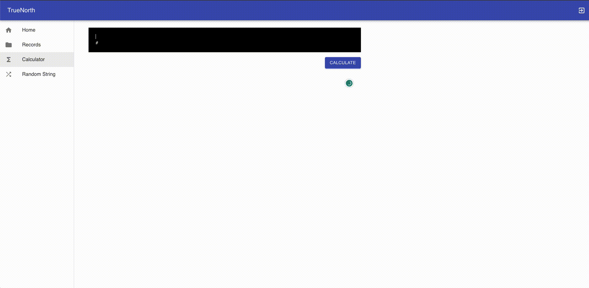
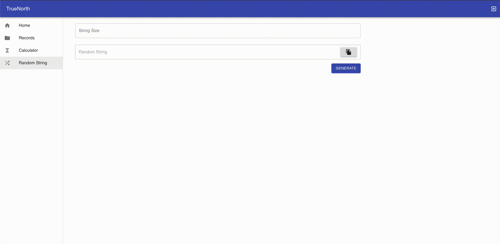

# Setup

The project is structured as follows:
  - root
    - components
    - pages
    - services
      - api


## Running Locally
To run the project, you'll need to create a .env file in the project directory and populate it with the following content:
```sh
REACT_APP_API_URL={API_URL}
```

To set up locally, you'll need to run the following commands:
```sh
npm install and npm start
```
The command will start the project locally on port 3000


## Running with Docker

To run the project with Docker, you will need to execute the following commands:
```sh
# This will build a nodejs image, install the dependencies and build the project
docker compose up 
```

The container will build the project and serve it using the "serve" package on port 3000.

## Public URL

The project is deployed on the following URL:

http://test-d8ad859e.s3-website-us-east-1.amazonaws.com

## How it works?

We have two isolated features, one to execute a expression to calculate the results and another one to generate a random string from a given length.

The first feature is located on the "Calculator" page, where you can type a expression and click on the "Calculate" button to see the result.

[](screenshot_calculator.gif)

    
The second feature is located on the "Random String" page, where you can type a length to be the size of a random string and click on the "Generate" button to see the result.

[](screenshot_random-string.gif)
